Windows10 のPCにパッケージ管理システム Yarn をインストールして確認するまでの手順を備忘録としてまとめました。参考にして頂ければ幸いです。

- 前提条件（動作環境）
- yarnのインストール
- インストール完了の確認

なお、[modenバージョン](https://yarnpkg.com/) と[classicバージョン](https://classic.yarnpkg.com)がありますが、今回は[classicバージョン](https://classic.yarnpkg.com) インストールです。

# 前提条件（動作環境）

公式ページに Windows 用に用意されているのは次の３つ。

- npm 経由でインストールする
- インストーラをダウンロードする
- Chocolatey 経由でインストールする
- Scoop 経由でインストールする

Node.js にされている npm経由でインストールすることが推奨とのことですが、うまくいかなかったので（詳細は省略）、今回は、とりえす、「インストーラをダウンロードする」を選択しました。   
そのための前提条件は次の通りです。

- Node.js がインストールされ、動作すること
- npm がインストールされ、動作すること

これらの前提がまだ満たせていない場合はまずは次の記事を参考に前提部分の環境構築を完了させてください。

https://qiita.com/gahoh/items/8444da99a1f93b6493b4


なお、検証した動作環境は次の通りです。

- OS: Windows 10 Pro 21H2
- Node.js: v16.15.0
- npm: 8.5.5

# yarnのインストール

yarnの [公式ページ](https://yarnpkg.com/) 

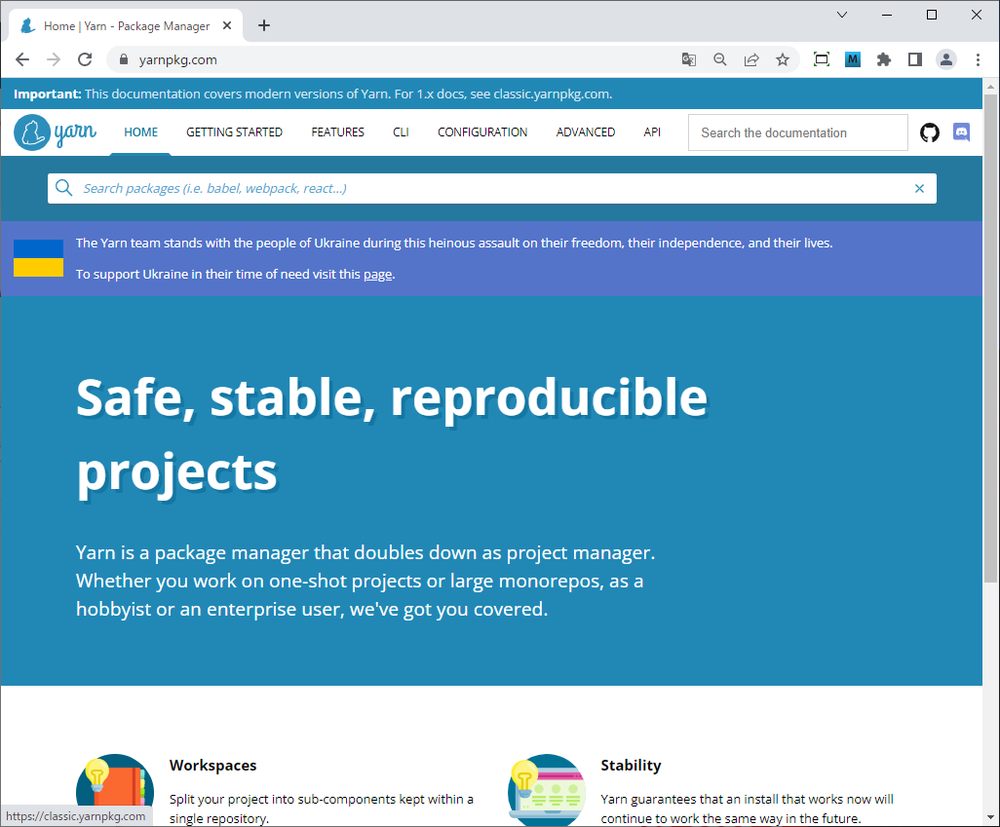 <br>

 [Yarn 1 (Classic)](https://classic.yarnpkg.com) のサイト へ移動。

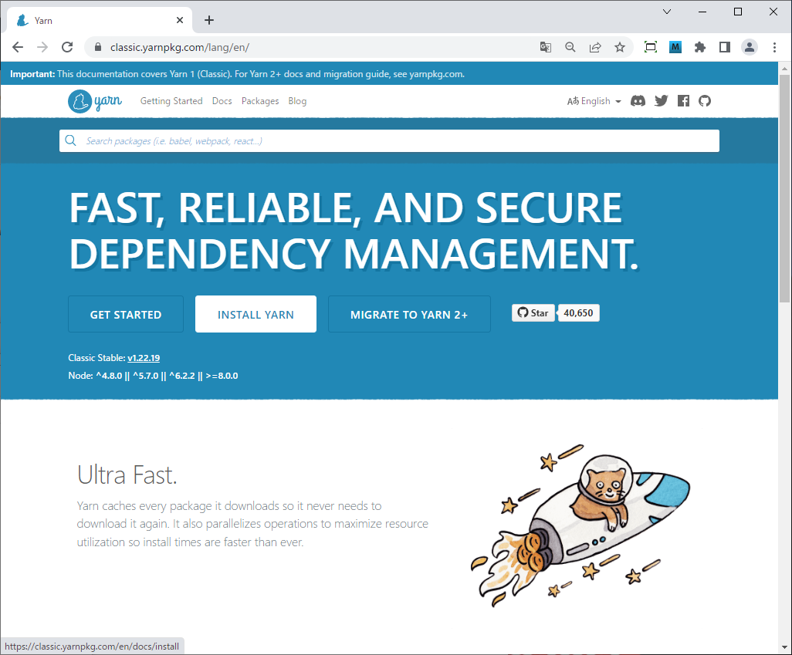 <br>

[INSTALL YARN] をクリック

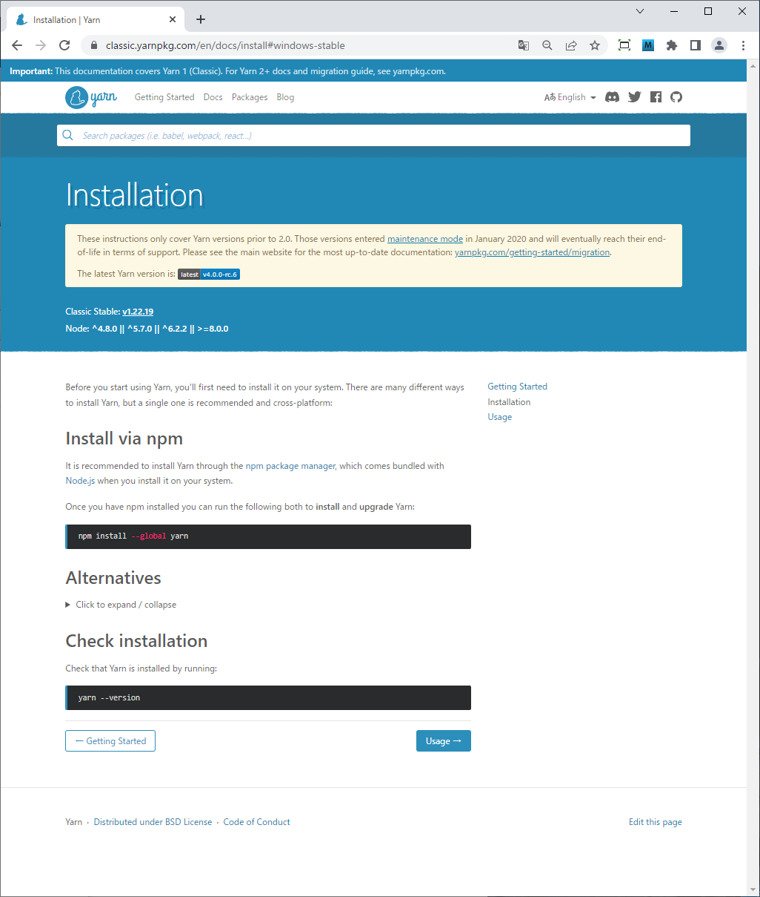 <br>

[▶ Click to expand / collapse]  をクリック
 
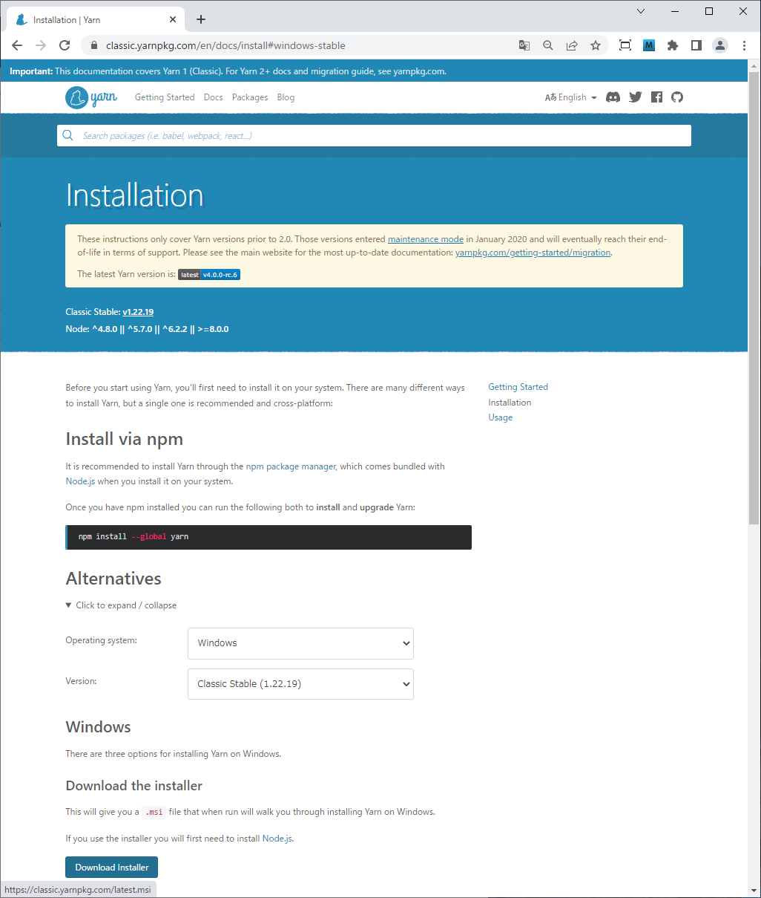 <br>

[Download Installer] をクリック

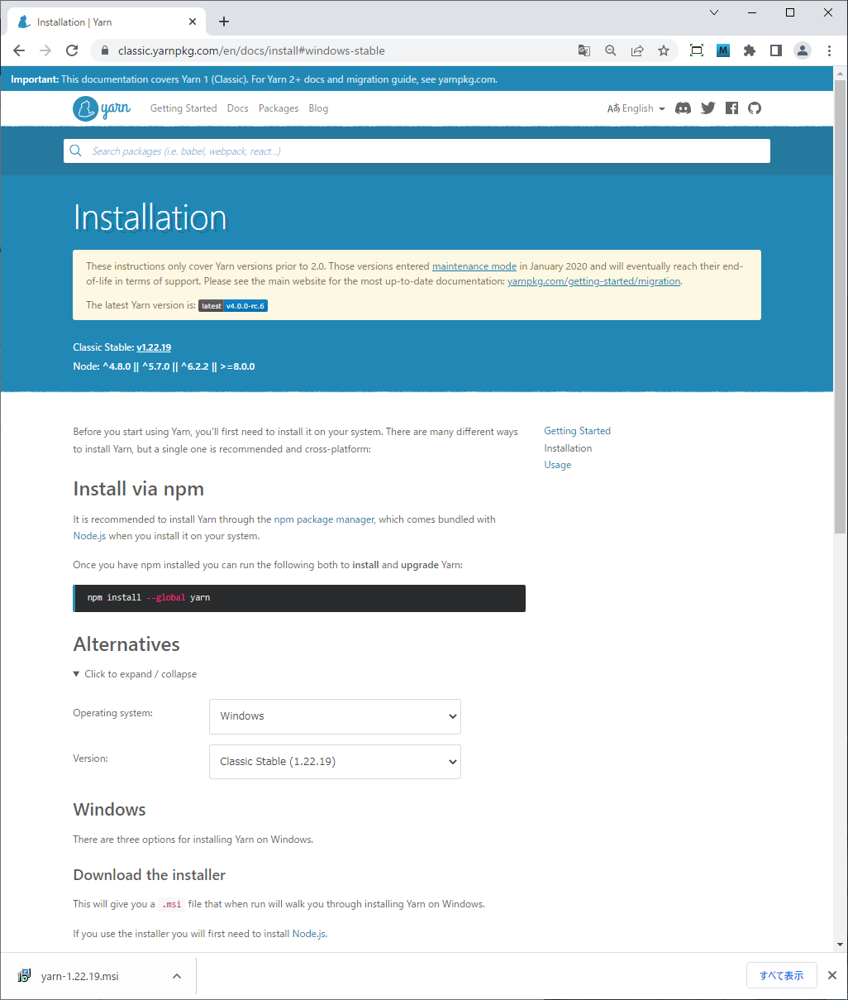 <br>

インストーラをダブルクリックすると、次のような画面が表示されインストールの実行が開始されます。<br>

[Next] をクリックする。

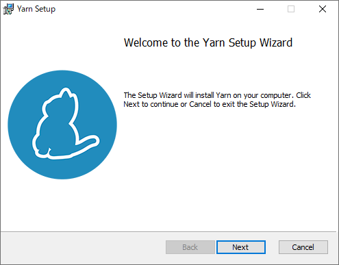 <br>

[Next] をクリックする。

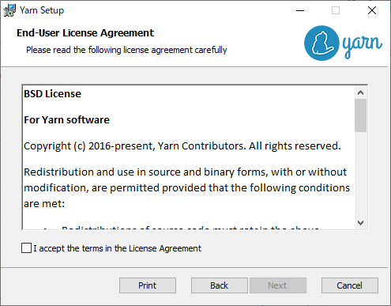 <br>

[I accept the term in the Licence Agreement] にチェック。

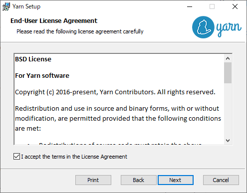 <br>

[Next] をクリックする。

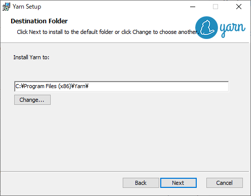 <br>

インストール先を選択し、[Next] をクリックする。

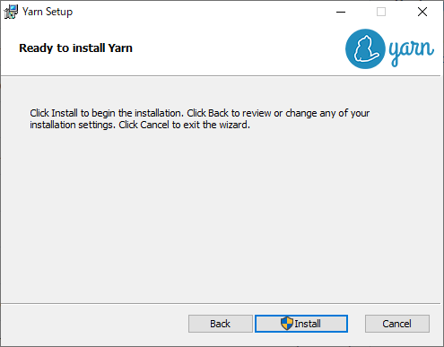 <br>

[Install] をクリックし、インストールを開始する。

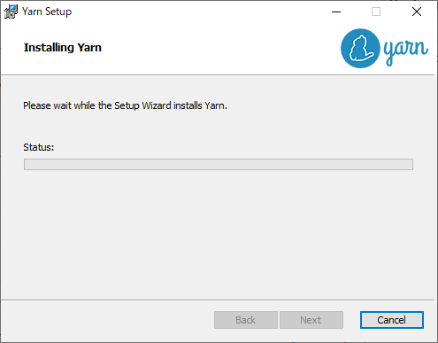 <br>

インストールは数十秒～1分程で終了したと思います。

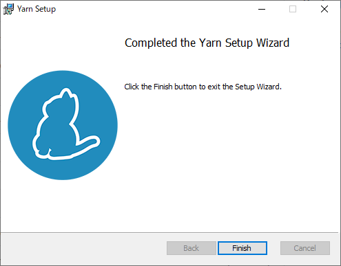 <br>

インストールが完了。最後に [Finish] をクリックすれば、インストール作業は終わりです。。

# インストール完了の確認

引き続き、ちゃんとインストールされたかの確認も行っていきます。

Yarn のインストールを確認するには、コマンドプロンプトで次のコマンドを実行します。

```
> yarn -v
1.22.19
>
```

これで、Windows に Yarn (Yarn Classic) のインストールは完了です。
---
