<!--
title: macOS に Node.js (npm) をインストールする方法
tags: nodejs npm install macos
id:      d2004f711748bf493f6a
private: true
-->
macOS のPCに[Node.js](https://nodejs.org/ja/about/)とパッケージ管理システム npm (Node Package Manager) をインストールして確認するまでの手順を備忘録としててまとめました。参考にして頂ければ幸いです。

- 前提条件（環境）
- インストーラーのダウンロード
- Node.jsのインストール
- インストール完了の確認

# 前提条件（環境）

今回インストール下のハードウェアのmacOSの仕様は次の通りです。

- macOS Monterey バージョン  12.3.1

# インストーラーのダウンロード

Node.jsの[公式日本語サイト](https://nodejs.org/ja/)にアクセスすると、OSに対応したインストーラが表示されるので、そのままダウンロードします。<br>
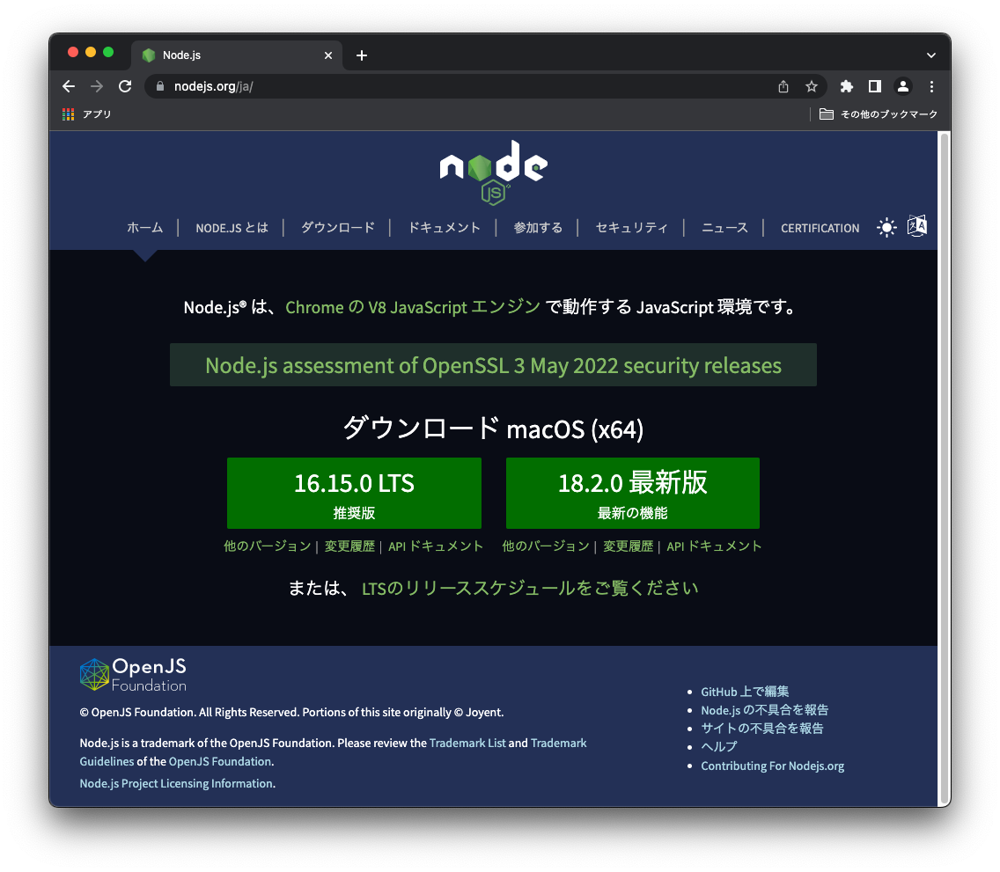 <br>
ここでは、LTS（安定版）の 16.15.0　をダウンロードしています。<br>

<!--
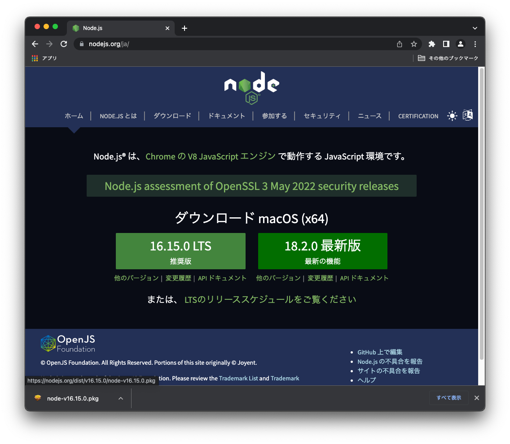
-->

<!--
ダウンロードされます。<br>
左下の [node-v16.15.0.pkg]　をクリックし、[Finder で表示を]　を選択することで、ダウンロードしたインストーラーが展開されます。
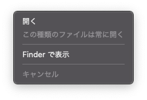
-->

# Node.jsのインストール

インストーラーをダウンロードしたら、早速ファイルを実行してをインストールしていきましょう。
なお、インストールの手順は他のmacosアプリと同じようにインストーラーが自動的に行ってくれるため、とても簡単です。また、基本的には特別なオプションを指定することなくインストールを行えばOKです <br>
なお、Node.jsをインストールすると、一緒にパッケージ管理ツールのnpmが利用できるようになります。

## はじめに
ダウンロードしたインストーラー node-v16.15.0.pkg をクリックし、インストール実行します。<br>
インストール画面が起動したら、[続ける] をクリックする。<br>
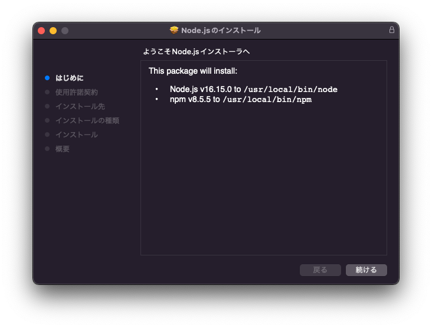<br>

## 使用許諾契約
使用許諾契約を確認・チェックしたあとに[続ける] をクリックする。<br>
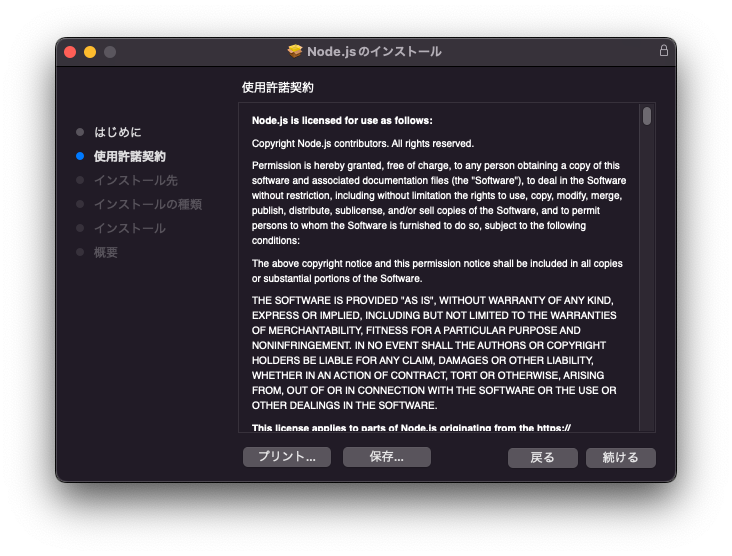<br>
次のような画面が表示されたら、[同意する] をクリックする。<br>
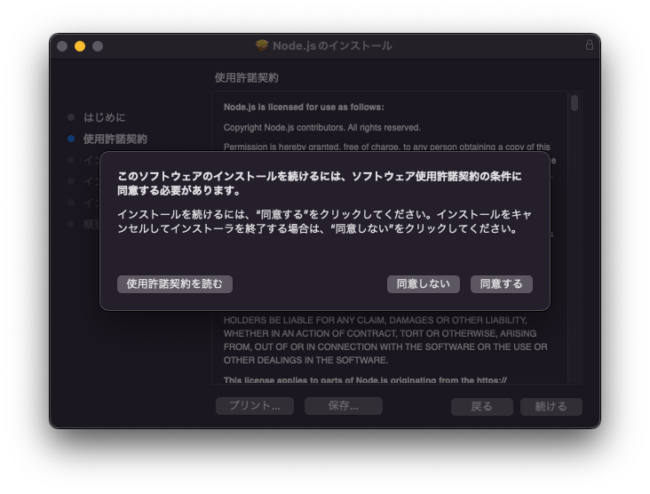<br>

## インストール先

### インストール先の選択
[続ける] をクリックする。<br>
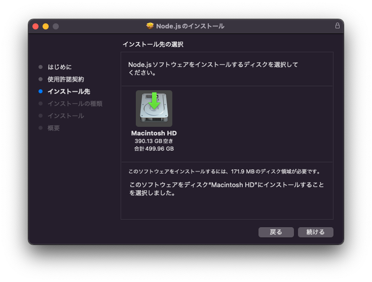<br>

## インストール先の種類
インストール先を指定します。ここでは、特に変更しなくて進めていきます。<br>
[インストール] をクリックする。<br>
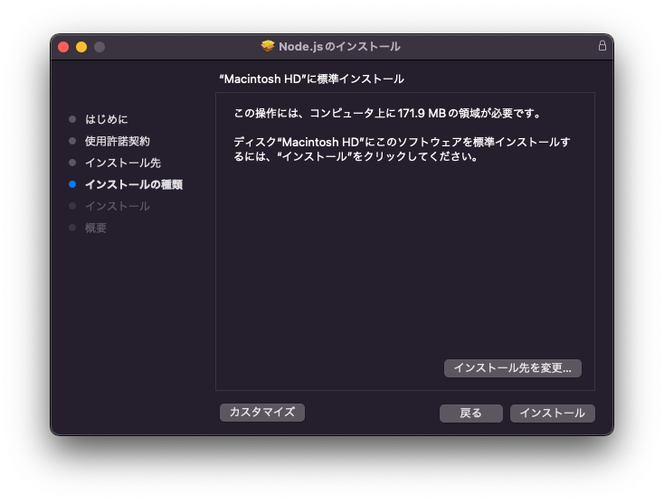<br>
パスワードを入力し、[ソフトウェアをインストール] をクリックする。<br>
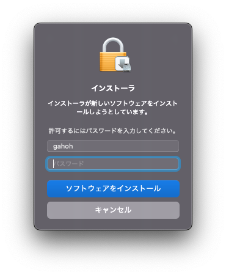<br>
インストール中になります。しばらくお待ちください。

## インストール

## 概要

インストールが完了。<br>
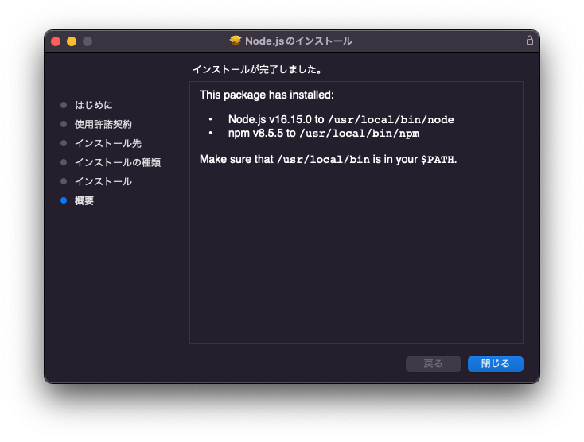<br>

[閉じる]をクリックする。<br>
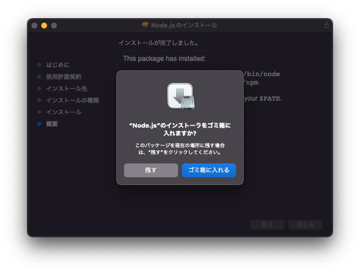<br>

以上でインストール完了となります。

# インストール完了の確認

引き続き、ちゃんとインストールされたかの確認も行っていきます。<br>

Node.jsとnpmのインストールを確認するには、ターミナルで次のコマンドを実行します。

```
node -v; npm -v
```
または、
```
node --version; npm --version
```

コマンドの実行結果にNode.jsおよびnpmのバージョンが表示できればOKです。
実行例は次の通りです。

```
$ node -v;npm -v
v16.15.0
8.5.5

```

これで、macOS への Node.js（npm）のインストールは完了です。

----
