<!--
title:  Windows への Node.js (npm) のインストール
tags:   node.js npm windows
author: gahoh
slide:  false
-->
Windows10 のPCに[Node.js](https://nodejs.org/ja/about/) とパッケージ管理システム [npm](https://ja.wikipedia.org/wiki/Npm_(%E3%83%91%E3%83%83%E3%82%B1%E3%83%BC%E3%82%B8%E7%AE%A1%E7%90%86%E3%83%84%E3%83%BC%E3%83%AB)) (Node Package Manager) をインストールして確認するまでの手順を備忘録としてまとめました。参考にして頂ければ幸いです。

- 前提条件（環境） 
- インストーラーのダウンロード
- Node.jsのインストール
- インストール完了の確認

# 前提条件（環境）

今回インストールするハードウェアの Windows の仕様は次の通りです。

- Windows 10 Pro 21H2

# インストーラーのダウンロード

Node.jsの[公式日本語サイト](https://nodejs.org/ja/)にアクセスすると、OSに対応したインストーラが表示されるので、そのままダウンロードします。<br>
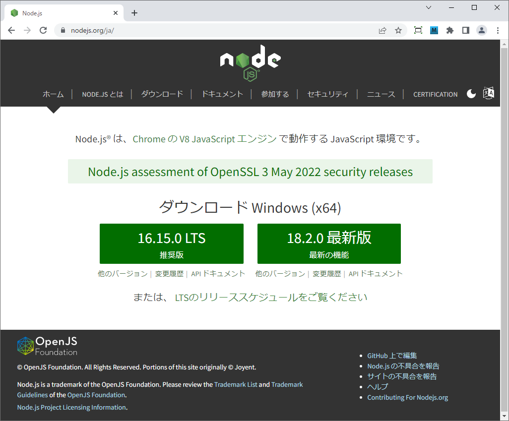 <br>
ここでは、[LTS（安定版: 長期の保守運用が約束されているバージョン）の 16.15.0]　をダウンロードします。<br>
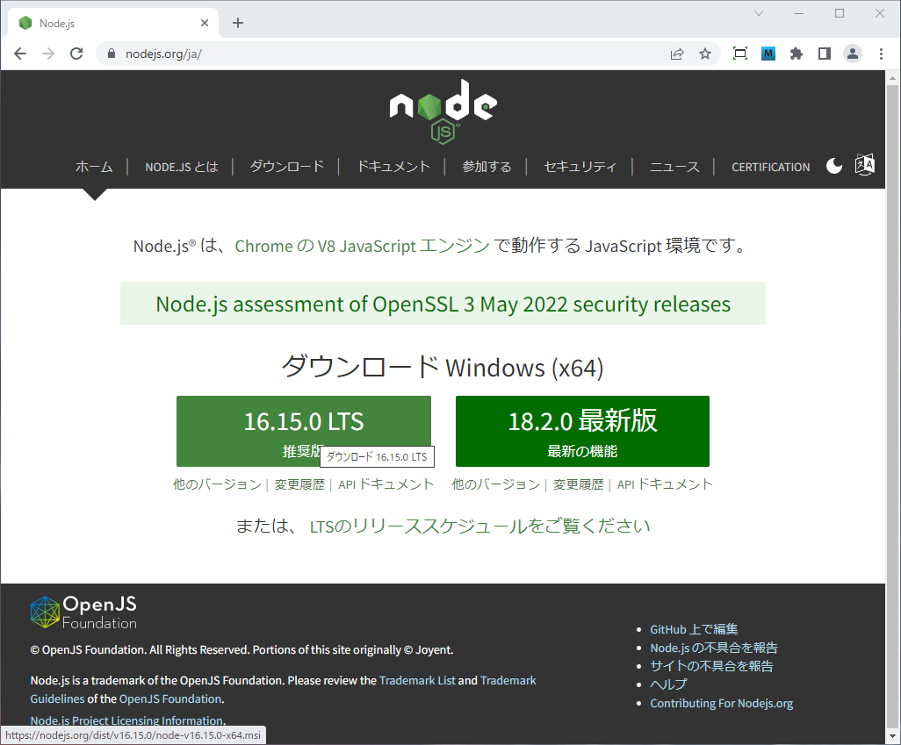
<!---
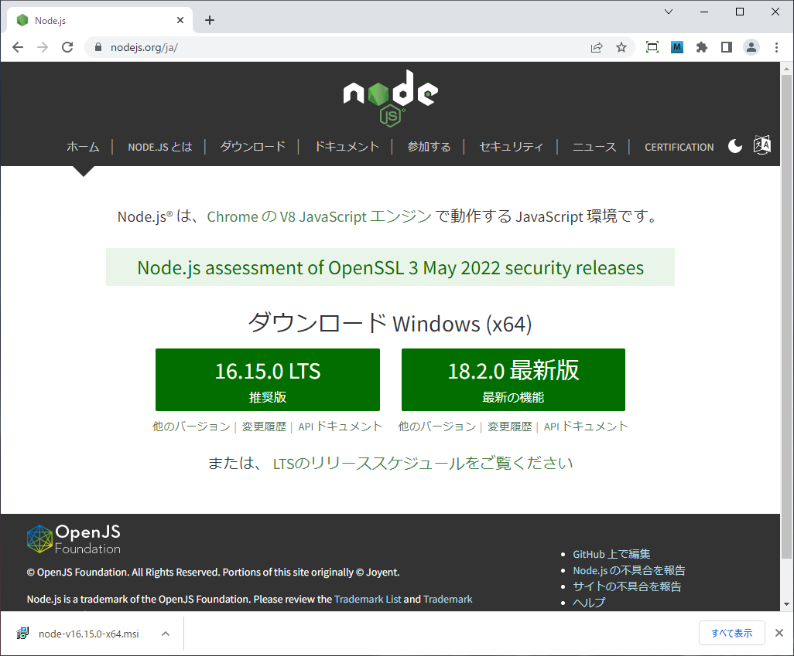
--->

[ダウンロードページ](https://nodejs.org/ja/download/)では、その他のプラットフォームのインストーラーをダウンロードすることが可能です。

# Node.jsのインストール
インストーラーをダウンロードしたら、早速実行してをインストールしていきましょう。
なお、インストールの手順は他の Windowsアプリケーションと同じようにインストーラーが自動的に行ってくれるため、とても簡単です。また、基本的には特別なオプションを指定することなくインストールを行えば、OKです <br>
なお、Node.js をインストールすると、一緒にパッケージ管理ツールの npm が利用できるようになります。

インストーラをダブルクリックすると、次のような画面が表示されインストールの実行が開始されます。
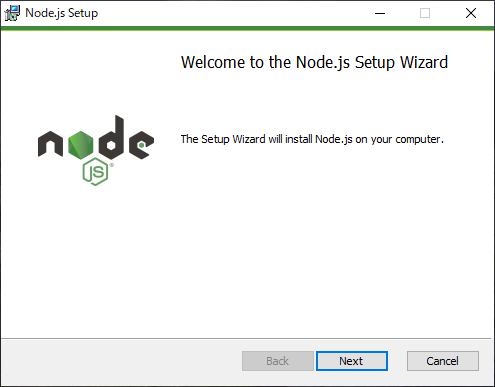<br>
[Next] をクリックする。<br>

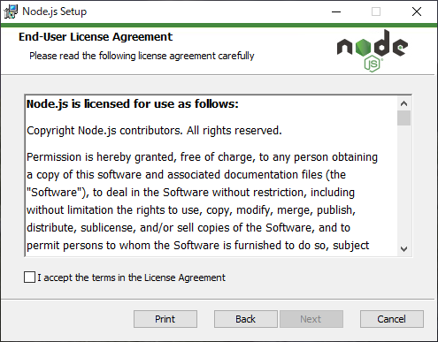<br>
[I accept the term in the Licence Agreement] にチェックを入れ、[Next] をクリックする。<br>

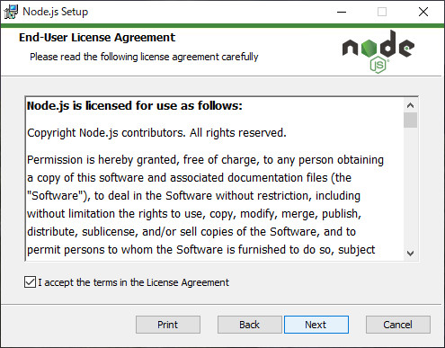 <br>
[Next] をクリックする。<br>
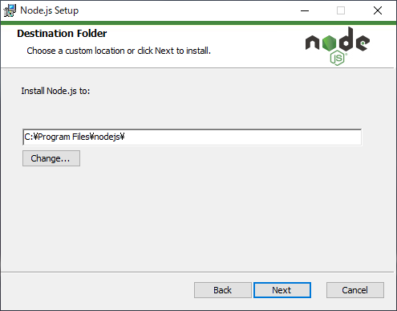 <br>
インストール先を選択し、[Next] をクリックする。<br>
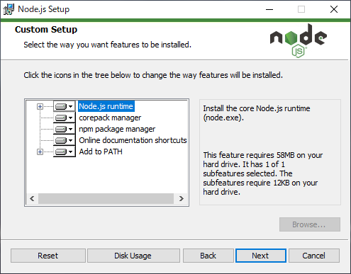 <br>
インストールしたいコンポーネントを選択し、[Next] をクリックする。<br>
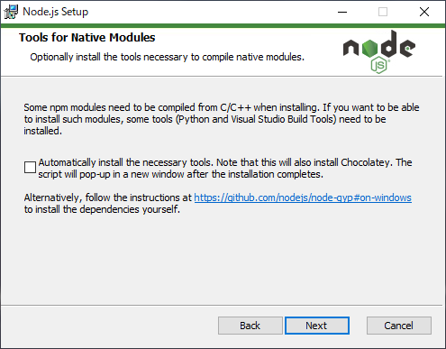 <br>
[Next] をクリックする。<br>
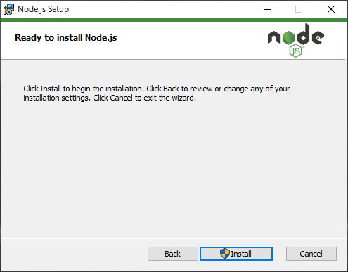 <br>
[Install] をクリックし、インストールを開始する。<br>
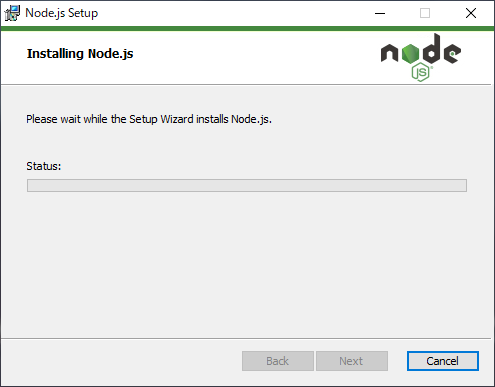
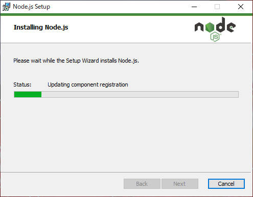 <br>
インストールは数十秒～1分程で終了します。<br> 
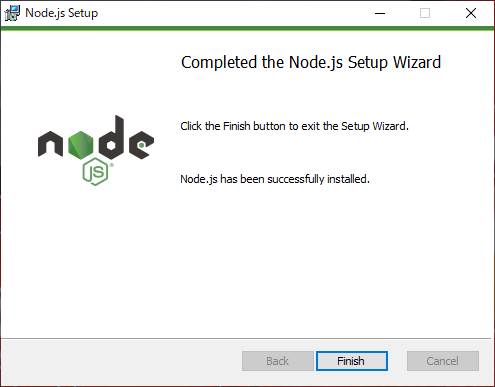 <br>
インストールが完了。最後に [Finish] をクリックすれば、インストール作業は終わりです。。<br>

以上でインストールは完了となります。

# インストール完了の確認

引き続き、ちゃんとインストールされたかの確認も行っていきます。

Node.js と npm のインストールを確認するには、コマンドプロンプトで次のコマンドを実行します。

```
node -v; npm -v
```
または、
```
node --version; npm --version
```

コマンドの実行結果に Node.js および npm のバージョンが表示できればOKです。
実行例は次の通りです。

```
> node -v; npm -v
v18.2.0
8.10.0
>
```
